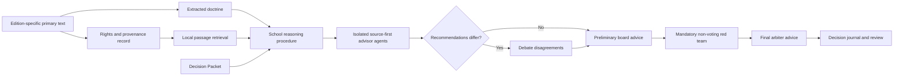

# Architecture

Phronesis separates evidence, interpretation, and behavior so a plausible answer cannot masquerade as a sourced one.

## Modules

- `models.py` validates Decision Packets and claim classifications.
- `doctrines.py` contains explicit school doctrine and source locators.
- `reasoning.py` is the transparent local baseline.
- `council.py` enforces independent advice, conditional debate, mandatory red-team challenge, and final arbitration.
- `sources.py` enforces source rights, hashes text, and retrieves passages.
- `journal.py` stores atomic, portable decision records and review analytics.
- `benchmark.py` evaluates contracts and citation presence across domains.
- `cli.py` exposes the complete workflow as JSON commands.

## Model-backed extension

`Council` depends on the small `Reasoner` protocol: `counsel(packet, doctrine) -> CounselResponse`. The Python class is an in-process contract boundary; it cannot itself create or prove isolation between external model sessions. A model-backed adapter must invoke that seam once per school in a fresh agent context. The advisor receives only the normalized packet, its doctrine and counsel procedure, its linked reference knowledge skill, and the response contract. It reads topic-relevant source-book material before evaluating options, derives feedback before proposing a recommendation, and returns structured output without seeing another conclusion. The coordinator collects and validates every initial response before comparison or synthesis. The Council validates school identity, option membership, confidence, required fields, declared source IDs and locators, grounding mode, and the extension container before conditional debate or synthesis. School-specific fields remain nested under `extensions`.

The bundled interactive Council skill performs this agent orchestration. The deterministic `HeuristicReasoner` remains an inspectable test and CLI baseline; it does not spawn agents, and optional corpus retrieval grounds its cited basis rather than replacing full source-led deliberation.

`Council.convene` assumes packet intake is complete. The total-agent workflow calls the separate `examine` seam first when objectives, terms, options, or evidence remain incomplete; a programmatic caller that has already completed intake may convene directly.
