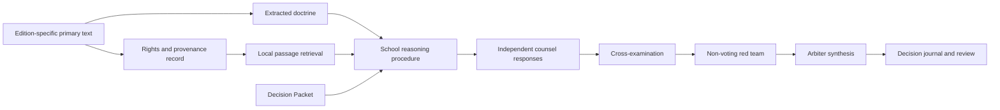

# Architecture

Phronesis separates evidence, interpretation, and behavior so a plausible answer cannot masquerade as a sourced one.

## Modules

- `models.py` validates Decision Packets and claim classifications.
- `doctrines.py` contains explicit school doctrine and source locators.
- `reasoning.py` is the transparent local baseline.
- `council.py` enforces independent counsel and the contest/arbiter protocol.
- `sources.py` enforces source rights, hashes text, and retrieves passages.
- `journal.py` stores atomic, portable decision records and review analytics.
- `benchmark.py` evaluates contracts and citation presence across domains.
- `cli.py` exposes the complete workflow as JSON commands.

## Model-backed extension

`Council` depends on the small `Reasoner` protocol: `counsel(packet, doctrine) -> CounselResponse`. A model adapter should receive only those two inputs, request structured output, validate it against `counsel-response.schema.json`, and attach retrieved source passages. Cross-examination and synthesis should continue to operate on validated contracts rather than free-form chat.
